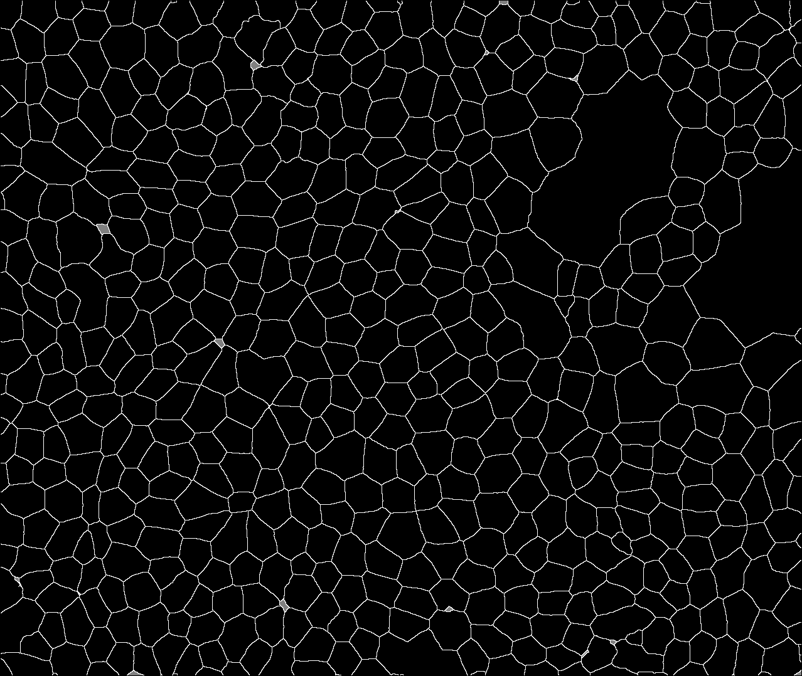

# imagetools

Python 3 native support for various image segmentation operations.

*Andrei I. Volkov (NIH/NEI Contractor)*

## Installation and setup

1. Select your target Python 3 environment (Conda Virtual Environment recommended),
make sure `swig` and `numpy` packages (pre-requisites) are installed.

2. Check out (or unzip) `imagetools` into a suitable directory `/path/to/imagetools/directory`.

3. Type:

	`python -m pip install /path/to/imagetools/directory`

4. To test installation, run python and type:

	```
	>>> import imagetools
	>>> imagetools.version()
	```

If the installation is OK, you will see the version number like this:

`'1.0.0 (2022-08-19)'`

To uninstall `imagetools` from your current Python 3 environment, type:

`python -m pip uninstall -y imagetools`

## API

-------

**`ver = imagetools.version()`** : Return module version as str

-------

**`imagetools.postprocess_particle_borders(mask)`** : Perform post-processing on 2D masks predicted by
cell border semantic segmentation ML models, such as REShAPE.

Parameters:

- `mask` : a binary mask (0=background, 255=foreground), a numpy array of shape (height,width) and dtype=numpy.uint8

Returns:

- `None`, `mask` is updated as shown below.

| Before: | After: |
|:--------|:-------|
|||

-------

**`particles = imagetools.detect_particles(mask)`** : Detect particles on an image mask showing particle borders,
such as the ones created by REShAPE or postprocess_particle_borders(). A *particle* in this case is an area painted
in background color, surrounded by borders (foreground color) from all sides, i.e. not "touching" image borders, etc.

Parameters:

- `mask` : a binary mask (0=background, 255=foreground), a numpy array of shape (height,width) and dtype=numpy.uint8

Returns:

- `particles` : a tuple of tuples containing particle data:
	`( (y1,xL1,xR1, y2,xL2,xR2, ...), (y1,xL1,xR1, y2,xL2,xR2, ...), ... )`
	Each inner touple contains pixel coordinates of a single particle in the form of segments y,xL,xR.
	Both xL and xR are included, segment length is xR-xL+1; a 1-pixel segment will have xL==xR.
	Segments are placed one after another in the same tuple, for a total length equal to the number of segments times 3.

- `mask` is updated as shown below:


-------

**`num_particles = imagetools.detect_particles_csv(mask, csvfile)`** : Same as detect_particles(),
but write the results into a CSV file, rather than return them as a Python object.

Parameters:

- `mask` : a binary mask (0=background, 255=foreground), a numpy array of shape (height,width) and dtype=numpy.uint8

- `csvfile` : (str) name of a CSV file to write detected particle data to.

Returns:

- `num_particles` : (int) number of detected particles

-------

**`particles = imagetools.masks_to_particles(masks[, x_orig, y_orig, [minarea]])`** : Convert array of object masks
(as returned by instance segmentation models such as Mask_RCNN) into a tuple of tuples containing particle data in the
same format as `detect_particles()`.

Parameters:

- `masks` : an array of binary masks (0=background, 255=foreground), one mask per particle,
	a numpy array of shape=(num_masks, height, width) and dtype=uint8,
	as returned by instance segmentation models such as Mask_RCNN.

Optional parameters:

- `x_orig`, `y_orig` : tile coordinate origins. Output coordinates are translated by adding the origin -
	good for reconstructing tiled images (just concatenate the outputs).
	
- `minarea` : if detected mask consists of several disconnected areas, filter out those smaller than this.

Returns:

- `particles` : a tuple of tuples containing particle data, same format as `detect_particles()`:
	`( (y1,xL1,xR1, y2,xL2,xR2, ...), (y1,xL1,xR1, y2,xL2,xR2, ...), ... )`
	Each inner touple contains pixel coordinates of a single particle in the form of segments y,xL,xR.
	Both xL and xR are included, segment length is xR-xL+1; a 1-pixel segment will have xL==xR.
	Segments are placed one after another in the same tuple, for a total length equal to the number of segments times 3.

-------

**`imagetools.assemble_ml(particles_3d, mask3d, csvfile[, postproc])`** : Perform 3D assembly (converrt multi-frame
2D particle data into 3D cell data).

Parameters:

- `particles_3d` : a list (or tuple) of particle data lists, each element corresponds to one frame worth of
particle data as returned by `detect_particles()` or `masks_to_particles()`; len(particles_3d) is equal
to the number of Z-frames in mask3d.

- `mask3d` : a numpy array of shape (num_frames, height, width) and dtype=numpy.uint8, where the output mask
is stored (0=inner cell pixels, 255=border cell pixels, 128=background pixels).
If `postproc` is `imagetools.POSTPROC_NONE` or `imagetools.POSTPROC_ACTIN`, the input array must be zeros;
if `postproc` is `imagetools.POSTPROC_DNA`, it must be pre-filled with binarized source DNA data, 0=background,
255=foreground (pixels where source pixel values are above lower Otsu trheshold in 3-way Otsu).

- `csvfile` : (str) a path to a file where the output cell data will be written to. Format is `ID,Frame,y,xL,xR`.

Optional parameters:

- `postproc` : (int) one of `imagetools.POSTPROC_NONE` (default), `imagetools.POSTPROC_DNA`, `imagetools.POSTPROC_ACTIN`
or `imagetools.POSTPROC_SANDPAPER`. The `imagetools.POSTPROC_SANDPAPER` option triggers removal of segmentation artifacts
("appendages" or "micro-satellites"), same as `imagetools.sandpaper_cells()`. This flag can be used in conjunction
with `imagetools.POSTPROC_DNA` or `imagetools.POSTPROC_ACTIN` using logical OR `'|'`:

```
	imagetools.assemble_ml(particles_3d, mask3d, csvfile, imagetools.POSTPROC_DNA | imagetools.POSTPROC_SANDPAPER)
	imagetools.assemble_ml(particles_3d, mask3d, csvfile, imagetools.POSTPROC_ACTIN | imagetools.POSTPROC_SANDPAPER)
```

-------

**`result = imagetools.compare_3d_annotations(width, height, num_frames, base_csv, cmp_csv)`** : Compare
two sets of 3D segmentation results.

Parameters:

- `width`, `height`, `num_frames` : (int) dimensions of the 3D image on which the segmentations were performed.

- `base_csv` : (str) path to file containing base segmentation, formatted as `ID,Frame,y,xL,xR`, such as one
produced by `assemble_ml()`.

- `cmp_csv` : (str) path to file containing segmentation to compare the base segmentation to. Same format
`ID,Frame,y,xL,xR`.

Returns:

- `result` : (`imagetools.Compare3dResult`), a data structure with the following attributes:

	- `base_cells` : (int) number of 3D cells loaded from 'base_csv`

	- `cmp_cells` :(int) number of 3D cells loaded from `cmp_csv`

	- `base_slices` : (int) number of 2D cell slices (particles) loaded from `base_csv`

	- `cmp_slices` : (int) number of 2D cell slices (particles) loaded from `cmp_csv`

	- `f_pos` : (int) number of 2D false positives

	- `f_neg` : (int) number of 2D false negatives

	- `fragm` : (int) number of fragmented 2D slices

	- `fused` : (int) number of fused 2D slices

	- `pct_match` : (int array of size 100) spread of 1-1 2D slice matches by IoU percentages

	- `f_pos_3d` : (int) number of 3D false positives

	- `f_neg_3d` : (int) number of 3D false negatives

	- `fragm_3d` : (int) number of fragmented 3D cells

	- `fused_3d` : (int) number of fused 3D cells

	- `pct_match_3d` : (int array of size 100) spread of 1-1 3D cell matches by IoU percentages

	Note that `base_slices==f_neg+fragm+fused+sum(pct_match)` and
	`base_cells==f_neg_3d+fragm_3d+fused_3d+sum(pct_match_3d)`.

-------

**`result = imagetools.imagetools.border_pixels(w, h, d, csvfile)`** : Extract border pixel coordinates from
segmentation data.

Parameters:

- `w`, `h`, `d` : (int) dimensions of the 3D image on which the segmentations were performed (`d` = number of frames).

- `csvfile` : (str) path to file containing 3D segmentation, formatted as `ID,Frame,y,xL,xR`, such as one
produced by `assemble_ml()`.

Returns:

- `result` : (tuple of tuples of tuples), pixel data formatted like this:

```
	(
		((x0,y0,z0), (x1,y1,z1), ...),	# object 1
		((x0,y0,z0), (x1,y1,z1), ...),	# object 2
		((x0,y0,z0), (x1,y1,z1), ...),	# object 3
		...
	)
```

The outer tuple contains object tuples representing segmented objects, one entry per ID
The object tuples contain coordinate tuples of size 3 (x, y, z), one entry per border pixel.

-------

**`imagetools.rs_tops_bottoms(mask3d)`** : Add cell tops and bottoms to REShAPE3D Ground Truth data.

The procedure tries to identify cell objects (using `imagetools.assemble_ml()`) and "complement" cell borders
at cell tops and bottoms.


Parameters:

- `mask3d` : a numpy array of shape (num_frames, height, width) and dtype=numpy.uint8, the Ground Truth for
REShAPE3D obtained by REShAPE-ing and post-processing individual frames in Actin channel. 0 = background,
255 = foreground (cell walls, mostly vertical).

Returns:

- None, `mask3d` is updated with cell tops and bottoms.

-------

**`imagetools.sandpaper_cells(w, h, d, in_csv, out_csv)`** : Remove loosely connected "appendages" and disconnected
"micro-satellites" (segmentation artifacts) from segmented 3D objects, like this:


The procedure first "erodes" input objects (one by one) by 1 pixel to completely isolate loosely connected appendages
(if any), then detect all resulting disconnected parts using a flood fill algorithm, then picks up the biggest part
and removes the rest. The remaining part is "dilated" by 1 pixel to restore original boundaries (as close
as possible). As a result, some small input objects may completely disappear from the output data.

Parameters:

- `w`, `h`, `d` : (int) dimensions of the 3D image on which the segmentations were performed (`d` = number of frames).

- `in_csv` : (str) path to file containing input 3D segmentation, formatted as `ID,Frame,y,xL,xR`, such as one
produced by `assemble_ml()`.

- `out_csv` : (str) a path to a file where the output cell data will be written to. Format is `ID,Frame,y,xL,xR`.

-------

**`imagetools.paint_cells(mask3d, csvfile)`** : Generate RPE Map -style 3D object mask out of cell data spreadsheet.

Parameters:

- `mask3d` : an empty numpy array of shape (num_frames, height, width) and dtype=numpy.uint8, where the output mask
is stored (0=inner cell pixels, 255=border cell pixels, 128=background pixels).

- `csvfile` : (str) a path to a file where the input cell data will be read from. Format is `ID,Frame,y,xL,xR`.

-------

